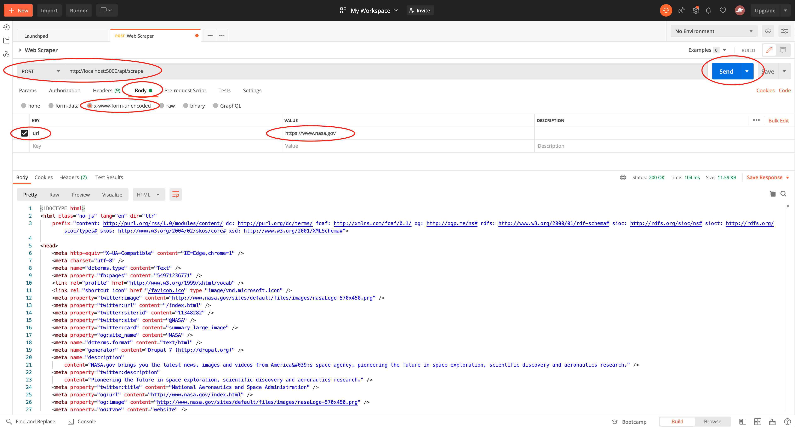

## Web Scraper 

**Part 2 Spec**: 

Convert your script into a rest API that can be passed a url and return the homepage content as a string.

**Instructions on how to run the Part 2 spec:**

1. Run `yarn start`.
1. Open the Postman application: https://www.postman.com/
1. Create a new post request in Postman
1. Set the URL to: http://localhost:5000/api/scrape
1. Set the body to: `x-www-form-urlencoded`
1. Set the key to: `url`
1. Set the value to: whatever url you would like to scrape (i.e. https://www.nasa.gov)
1. Click on the `send` button

Example:

