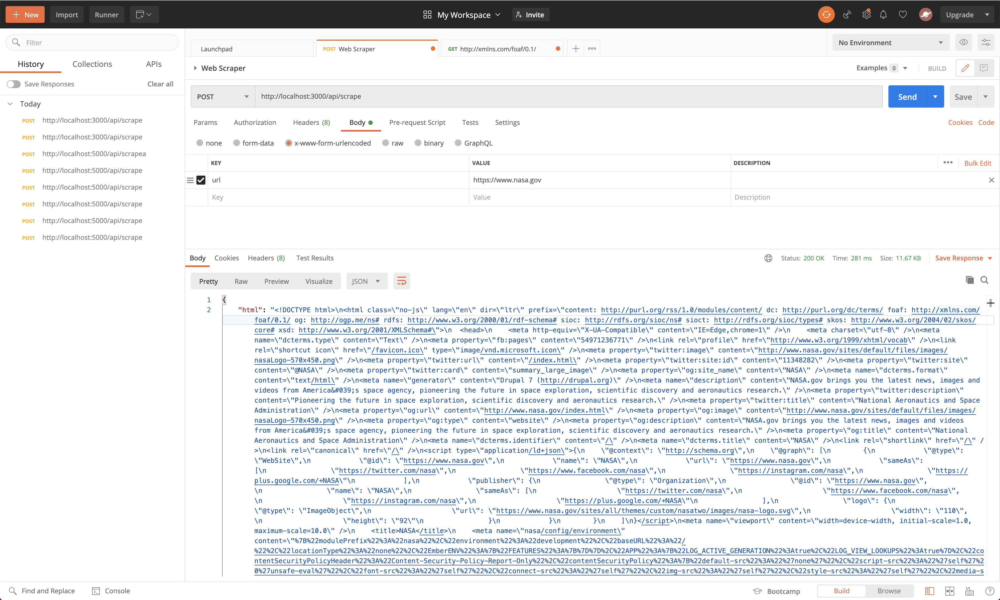
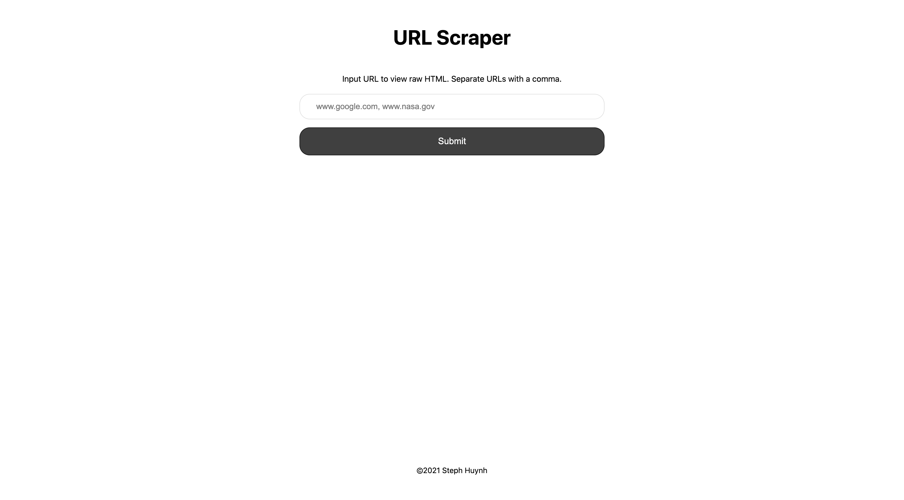
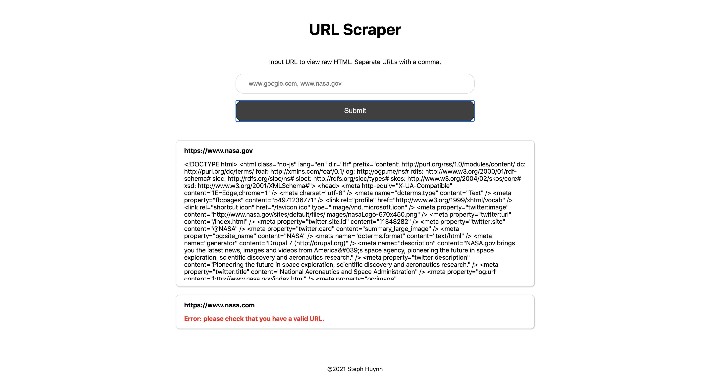

# # Web Scraper Coding Challenge

This coding challenge is broken up into three parts. Outlined below for each part are:

- Spec instructions.
- Instructions on how to run each spec.
- Screenshots of expected spec outcome(s).
---

**Part 1 Spec:**

Write a script that will scrape the content of three websites that you define and saves them on the local disk as .html pages. 

The three websites that I have chosen are:
- https://www.dmv.ca.gov
- https://www.google.com
- https://www.nasa.gov

**Instructions on how to run the Part 1 spec:**

1. From the master branch, checkout the `Part-1` branch.
1. From the Part-1 branch, run `node web-scraper/scrape.js`.
1. Observe that the .html files for the following websites populate inside the `scraped-sites` folder:
- https://www.dmv.ca.gov - dmv.html
- https://www.google.com - google.html
- https://www.nasa.gov - nasa.html

---

**Part 2 Spec**: 

Convert your script into a rest API that can be passed a url and return the homepage content as a string.

**Instructions on how to run the Part 2 spec:**

1. cd into the `user-interface` directory.
1. Run `yarn dev`.
1. Open the Postman application: https://www.postman.com/
1. Create a new post request in Postman
1. Set the URL to: http://localhost:3000/api/scrape
1. Set the body to: x-www-form-urlencoded
1. Set the key to: "url"
1. Set the value to: whatever url you would like to scrape (i.e. https://www.nasa.gov)
1. Click on the "send" button
Example:

---

**Part 3 Spec**: 

Build an interface with a text box that accepts one or more urls, and a button to submit the form. 

Use your api from Part 2 to display the content of each url as a raw html string in a results area of the interface. 

We should be able to tell which url corresponds with which html string.

**Instructions on how to run the Part 3 spec:**

1. cd into the `user-interface` directory.
2. Run `yarn dev`.
3. View the UI in your browser - localhost:3000.
4. Input any URL (separate URLs with a comma), click on the "submit" button to view the raw HTML of each URL.

---

**Technologies Used**:

- React.js
- Next.js
- SASS
- Axios
- Express

**Future Development**:

- Add unit and integration tests
- Add Postman tests
- Implement copy to clipboard functionality
- Implement download file functionality
- Append results
- Clear results

