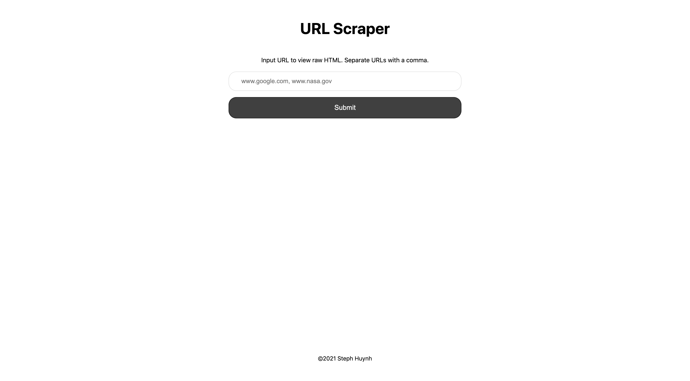
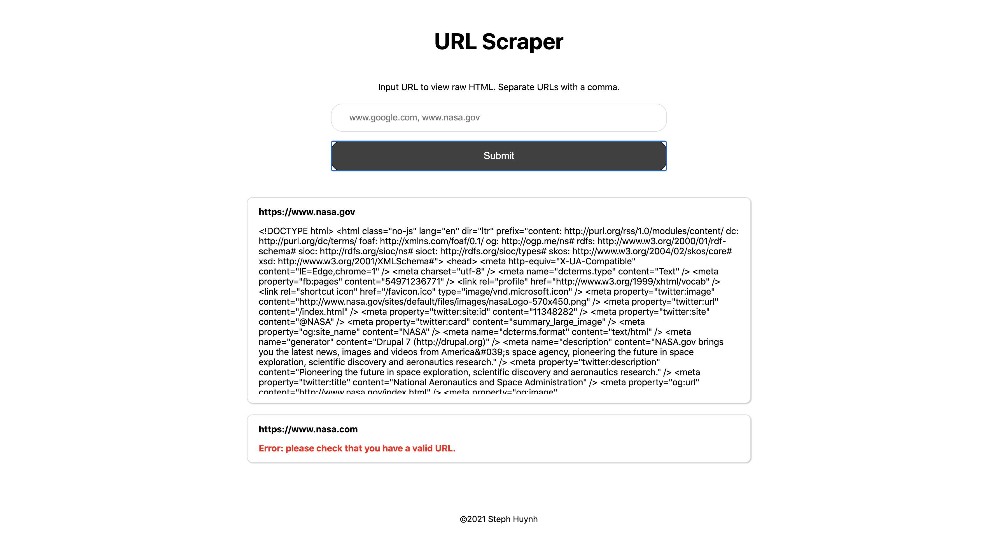
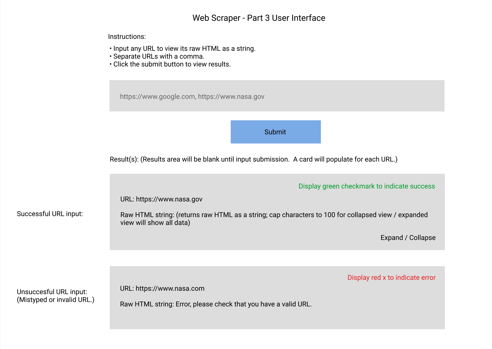

## Web Scraper

**Part 3 Spec**:

Build an interface with a text box that accepts one or more urls, and a button to submit the form.

Use your api from Part 2 to display the content of each url as a raw html string in a results area of the interface.

We should be able to tell which url corresponds with which html string.

**Instructions on how to run the Part 3 spec:**

1. Run `yarn` to install dependencies.
1. Run `yarn dev` to start the development server.
1. View the UI in your browser at http://localhost:3000.
1. Input any URL (separate URLs with a comma), click on the "submit" button to view the raw HTML of each URL.

**Before search:**

**After search:**

---

**Figma Wireframe**

[Figma Wireframe](https://www.figma.com/file/WzDbt7LTLYuoPKoqlbYPlH/Web-Scraper?node-id=0%3A1)
